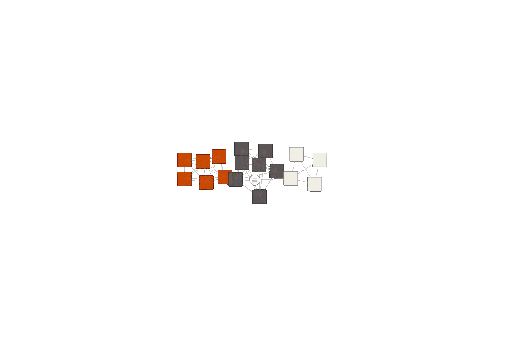

# Mapa del Libro ~ Formación y Oficio en Arquitectura y Diseño

Este repositorio define la visualiación de los capítulos y anotaciones –en forma de mapa- para el libro **"Formación y Oficio en Arquitectura y Diseño"** cuyos contenidos son tratados, discutidos y comentados durante el [Seminario Internacional Formación y Oficio en Arquitectura y Diseño](https://wiki.ead.pucv.cl/Seminario_Internacional_Formaci%C3%B3n_y_Oficio_en_Arquitectura_y_Dise%C3%B1o) celebrado en Ciudad Abierta entre los días 13, 14 y 15 de octubre de 2022.


<p align="center">



</p>


Todos los textos del mapa son tomados de las publicaciones semánticas documentadas en [Casiopea](https://wiki.ead.pucv.cl/) bajo la forma de:

1. **Publicaciones**:Representan los capítulos inéditos (hasta ese momento) que se presentan como ponencias durante el seminario. Para que este mapa los incluya, deben definir los campos:
 - **Revista**: "Seminario Internacional Formación y Oficio en Arquitectura y Diseño"
 - **Nota**: el eje temático al cual se adscribe: **"investigación y creación", "bordes del oficio" o "escuela como obra"**
2. **Observaciones**: Representan el aporte de los asistenten en su forma de diálogo con los textos, su marginalia que los vincula y expande. Para que este mapa los incluya, deben definir los siguientes campos:
 - **Palabras Clave**: **```sfo```**, *hashtag* que corresponde a "seminario formación y oficio"
 - **Páginas Relacionadas**: Incorporar los títulos de las publicaciones (capítulos) que desea vincular con la observación. Pueden ser 1 o más. Si no incorpora ninguno, la observación no estará conectada dentro del mapa. Es de crucial importancia incorpora las páginas con su nombre idéntico a como está en la Wiki (título de la página, no necesariamente el título que está puesto en la ficha de publicación), respetando altas y bajas, tildes, etc.

El sentido de este mapa es provocar un juego de colaboración en la escritura de un texto hecho por muchos, dando espacio a las observaciones (en forma de anotaciones) al modo de una marginalia compartida que va escribiendo el texto desde los márgenes.

## Funcionamiento
El mapa se conecta con [Casiopea](https://wiki.ead.pucv.cl/) mediante la API y obtiene los resultados en formato **JSON**. 

La url se obtiene configurando la consulta en la [Zona de pruebas de la API](https://wiki.ead.pucv.cl/Especial:Zona_de_pruebas_de_la_API) de Casiopea.

El mapa realiza 2 consultas semánticas:

**Consulta por los capítulos**:

```
{{#ask:[[Categoría:Publicación]][[Revista::Seminario Internacional Formación y Oficio en Arquitectura y Diseño]]
|? Autor
|? Nota
|? Palabras Clave
}}
```

**url**: 
```
https://wiki.ead.pucv.cl/api.php?action=ask&format=json&query=%5B%5BCategor%C3%ADa%3APublicaci%C3%B3n%5D%5D%5B%5BRevista%3A%3ASeminario%20Internacional%20Formaci%C3%B3n%20y%20Oficio%20en%20Arquitectura%20y%20Dise%C3%B1o%5D%5D%20%7C%3F%20Autor%20%7C%3F%20Nota%20%7C%3F%20Palabras%20Clave&utf8=1&formatversion=latest
```

**Consulta por las observaciones**:

```
{{#ask:[[Categoría:Observación]][[Palabras Clave::sfo]]
|? Autor
|? Nota
|? Páginas Relacionadas
}}
```

**url**:
```
https://wiki.ead.pucv.cl/api.php?action=ask&format=json&query=%5B%5BCategor%C3%ADa%3AObservaci%C3%B3n%5D%5D%5B%5BPalabras%20Clave%3A%3Asfo%5D%5D%20%7C%3F%20Autor%20%7C%3F%20Nota%20%7C%3F%20P%C3%A1ginas%20Relacionadas&utf8=1&formatversion=latest
```

La Consulta por los capítulos construye los nodos principales y la consulta por las observaciones construye los nodos secundarios del mapa. 

Los vínculos entre capítulos se define por el criterio del *eje al cual se adcribe* (que corresponde a una parte del libro) y las observaciones se vinculan libremente a capítulos (a uno o más) modificando, de este modo, la configuración del mapa.

### Archivos
- [```starter.js```](js/starter.js) archivo principal que inicializa el mapa
- [```chapter.js```](js/chapter.js) definición del objeto "Capítulo"
- [```annotation.js```](js/annotation.js) definición del objeto "Anotación" (u observación)
- [```edge.js```](js/edge.js) definición del objeto vínculo o vértice del grafo
- [```boundary.js```](js/boundary.js) definición del límite de la simulación (muros perimetrales)

#### Librerías
- [```P5js```](https://p5js.org) 
- [```Matter.js```](https://brm.io/matter-js/)